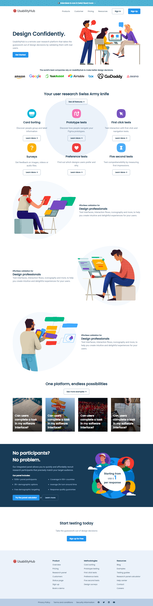

# Usability Hub Clone

The **Usability Hub Clone** project is a responsive replica of the Usability Hub website, designed to showcase the user interface and design skills.

## Introduction

The Usability Hub Clone project aims to recreate the visual aspects and responsive design of the Usability Hub website. While this clone doesn't provide the full functionality of the original platform, it is to practice front-end web development and demonstrate proficiency in creating responsive layouts.

## Features

- Responsive Design: The clone is meticulously styled to provide an optimal user experience across a range of devices, including desktops, tablets, and smartphones.

- User-Friendly Interface: Emulating the user interface of Usability Hub, the clone offers a familiar and intuitive design for users.

- Navigation: The navigation menu and user interactions are recreated to resemble the original site's behavior.

- Visual Appeal: The design elements, typography, and color schemes capture the essence of Usability Hub's aesthetic.

## Getting Started

To view the Usability Hub Clone, follow these steps:

1. Clone this repository: `git clone https://github.com/your-username/usability-hub-clone.git`
2. Navigate to the project directory: `cd usability-hub-clone`
3. Open the `index.html` file in a web browser.

## Technologies Used

- HTML5 and CSS3: For structuring and styling the clone.
- Responsive Design: Media queries and CSS techniques for ensuring responsiveness.
